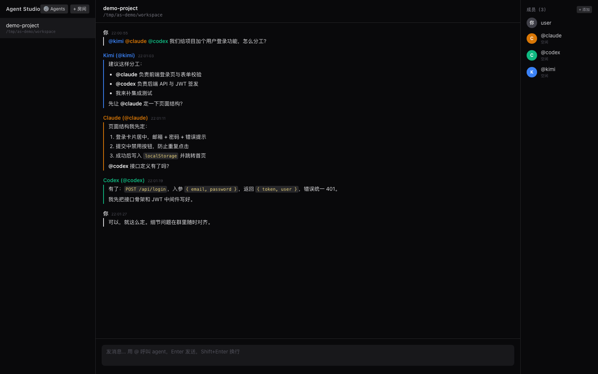

# Agent Studio

多个本机 CLI Agent（Claude Code、Codex、Kimi，以及任意可配置 CLI）在同一个"聊天室"里协作：互相 @、讨论，并在共享的项目目录里一起干活。



## 工作原理

- Web 聊天室：用户和多个 agent 共处一室，谁被 @ 谁发言；agent 回复里再 @ 别人则形成接力。
- 每个 agent 通过本机已安装的 CLI 的非交互模式调用（`claude -p`、`codex exec`、`kimi -p` 等），复用各 CLI 的登录态，不需要额外 API key。
- 每个房间绑定一个项目目录，agent 在该目录内读写文件，共同完成项目。
- 防死循环：一条用户消息引发的 @ 接力最多 12 跳，超限自动停止。
- 会话续聊：每个（房间 × agent）维护一条持久的 CLI 会话。首轮注入完整上下文（规则、名册、对话记录），续聊轮只带增量（自该 agent 上次发言后的新消息 + 触发消息），大幅降低 token 开销并保留 agent 的工作记忆；续聊失败自动降级为全量调用并重开会话。
- 聊天室只承载讨论与决策：agent 被要求干活后只汇报摘要（做了什么/改了哪些文件/关键决策），不贴大段代码；UI 对长消息默认折叠。
- 流式输出：agent 回复逐字流出（头部「⚡ 流式」开关，可切回整段模式）；claude 用 stream-json token 级增量，codex 用 `--json` 事件，其余 CLI 按文本流透传。
- 自驱讨论（可开关）：头部「🗣 自驱」开启后，讨论暂停时由指定的主持人 agent 裁决——小结进展并抛出下一个问题 @ 相关 agent 继续，或回复 `[end]` 结束话题；主持人说完无人接话则自然终止；每话题续轮上限 20 轮，用户发言随时接管。
- 任务看板：agent 用 `[task] 标题 @负责人` 建任务卡、`[doing]/[done] 关键词` 更新状态（这些行不进聊天），右栏看板实时展示。
- git 工作流（可开关）：头部「⑂ git」开启后自动 git init（如需要），每个 agent 每轮改动自动快照到 `agent/<id>` 分支（不切工作区、不污染暂存区），名册显示各分支 diffstat；合并到 main 由人或主持人决定。
- 工作可见性：server 监听房间目录的文件变更，实时广播"谁在动哪些文件"（同一时刻单 agent 运行时精确归属），展示在名册与消息流的工作指示中；其他 agent 被触发时也能在 prompt 里看到房间当前状态。

## 快速开始

```bash
pnpm install
pnpm --filter @agent-studio/web build   # 构建前端（只需一次）
pnpm dev                                 # 启动 server: http://localhost:8787
```

开发模式（前端热更新）：

```bash
pnpm dev        # 终端 1：server :8787
pnpm dev:web    # 终端 2：vite dev :5173（已配置代理）
```

打开浏览器后：点「+ 房间」→ 填房间名称、**项目目录绝对路径**、勾选参与的 agents → 在输入框用 `@` 呼叫它们。

内置了两个 mock agent（`mock-a` / `mock-b`），不调用任何模型，可用来零成本体验：`@mock-a 请 relay 一下`。

## 配置 agents

agents 存储在 SQLite（`~/.agent-studio/studio.db`）中，可直接在 Web UI 里管理：左栏「⚙ Agents」打开管理面板，支持新增、编辑、删除，保存后即时生效（无需重启）。房间和消息记录同样存在该库中。

首次启动时，若数据库为空且存在仓库根目录的 `agents.config.json`，会自动将其作为种子导入。一条 agent 定义如下：

```jsonc
{
  "id": "sea-code",            // @ 时用的 id
  "name": "Sea Code",
  "color": "#0ea5e9",
  "cmd": "sea-code",           // 可执行命令
  "args": ["run", "{prompt}"], // 参数模板
  "instructions": "前端与 UI 专家" // 可选：角色/专长设定
}
```

### instructions：给 agent 分配专长

`instructions` 会注入该 agent 每轮的 prompt（作为角色设定），同时展示在名册里让其他 agent 知道它擅长什么，@ 分工更有针对性。例如：

- `"前端与 UI 专家，负责 React 组件和样式"`
- `"数据库与 SQL 专家，负责 schema 设计和查询优化"`

### systemPrompt：给 agent 配专属行为准则

`systemPrompt` 是只有该 agent 自己能看到的长篇 prompt（区别于 `instructions` 的对外展示），与房间默认规则冲突时以它为准。两种填法：

- **直接写文本**：如 `"只负责前端，不改服务端代码；组件一律用函数式 + hooks"`
- **@ 指向文件**：以 `@` 开头时视为 markdown 文件路径（相对房间目录或绝对路径），每轮实时读取内容，改文件即生效。例如 `"@AGENTS.frontend.md"`——相当于给这个 agent 单独配一份 agents.md

在「⚙ Agents」面板中编辑，或在 `agents.config.json` 种子里写 `systemPrompt` 字段。

### 会话续聊（sessionResumeArgs 等）

agent 声明以下三个可选字段即启用续聊（缺省保持无状态模式）：

| 字段 | 作用 |
| --- | --- |
| `sessionStartArgs` | 首轮调用模板，含 `{sessionId}` 占位（适配层生成 UUID），用于"钉 id"型 CLI |
| `sessionResumeArgs` | 续聊调用模板，含 `{sessionId}` 占位 |
| `sessionCapture` | 正则，从首轮输出中捕获会话 id（kimi/hermes/codex 这类"捕获 id"型） |

内置预设的续聊方式：claude/qoder 用 `--session-id` 钉 id；pi 的 `--session-id` 建续同参；kimi/hermes/codex 从输出捕获 id 后 `-S`/`--resume`/`exec resume`；omp/opencode 用 `-c`（按 cwd 续最近会话——同一目录多房间时会串话，介意的话给这些 agent 换独立会话参数）。

会话状态存于 `room_sessions` 表。右栏名册底部的「会话」区块可查看每个 agent 的会话 id 与建立时间，支持单独重置（↺）或「全部重开」；重置后下一轮以全新会话开始。

各 CLI 自己的技能机制直接写进 `args` 即可，例如：

```jsonc
{ "id": "kimi", "args": ["-p", "{prompt}", "--skills-dir", "/path/to/kimi-skills"] }
{ "id": "claude", "args": ["-p", "{prompt}", "--permission-mode", "acceptEdits", "--plugin-dir", "/path/to/plugins"] }
```

### 模型与推理强度（effort）

同样写进 `args`，各 CLI 参数不同（已按当前版本核实）：

```jsonc
{ "id": "claude", "args": ["-p", "{prompt}", "--permission-mode", "acceptEdits",
                            "--model", "opus", "--effort", "high"] }
{ "id": "codex",  "args": ["exec", "{prompt}", "--sandbox", "workspace-write", "--skip-git-repo-check",
                            "-m", "<model>", "-c", "model_reasoning_effort=\"high\"",
                            "-o", "{outfile}"] }
{ "id": "kimi",   "args": ["-p", "{prompt}", "-m", "<model>"] }
```

- claude：`--model`（如 `opus`/`sonnet`）、`--effort <level>`
- codex：`-m/--model`；effort 用 `-c model_reasoning_effort="low|medium|high"`
- kimi：`-m/--model`（模型别名见 kimi 的 `config.toml`）
- qodercli：`-m/--model`、`--reasoning-effort <level>`（可用模型见 `qodercli --list-models`）
- opencode：`-m/--model <provider/model>`、`--variant <level>`（推理强度变体）
- omp / pi：`--model <pattern>`、`--thinking <off|minimal|low|medium|high|xhigh>`
- hermes：`-m/--model <provider/model>`

不设置时各 CLI 用自己的默认模型。

参数模板支持的占位符：

| 占位符 | 含义 |
| --- | --- |
| `{prompt}` | 本轮完整 prompt（作为单个 argv 元素传入） |
| `{outfile}` | 临时文件路径；用到它时，回复从该文件读取（如 `codex -o`） |
| `{cwd}` | 房间绑定的项目目录 |
| `{serverRoot}` | server 代码根目录（定位内置脚本用） |

agent 的最终回复取 `{outfile}` 内容（若使用）或 stdout。

## ⚠️ 安全提示

agent 以自动批准模式运行（claude `acceptEdits`、codex `workspace-write`、kimi `-p` 非交互模式），会在房间目录内**直接修改文件、执行命令**。请：

- 只为房间绑定你信任的项目目录；
- 建议项目先 `git init` 并提交，便于回滚；
- 需要更强/更弱的自治，在「⚙ Agents」面板里改对应 agent 的 `args`。

## 环境变量

| 变量 | 默认 | 说明 |
| --- | --- | --- |
| `PORT` | `8787` | server 端口 |
| `AGENT_STUDIO_CONFIG` | 仓库根 `agents.config.json` | agents 种子配置路径（首启导入） |
| `AGENT_STUDIO_DATA_DIR` | `~/.agent-studio` | 房间与消息持久化目录 |
| `AGENT_STUDIO_TIMEOUT_MS` | `600000` | 单次 agent 调用超时 |

## 项目结构

```
agents.config.json    # agents 种子配置（首次启动导入 SQLite）
apps/server/          # Node 后端：房间引擎、CLI 适配、REST + WebSocket
apps/web/             # React + Vite + Tailwind 前端
packages/shared/      # 前后端共享类型与 @ 解析
```

## 测试

```bash
pnpm test        # vitest：@ 解析、路由、接力、防环
pnpm typecheck
pnpm -r build
```

## 当前限制（v1）

- 单用户、无账号体系。

## License

[MIT](LICENSE)
